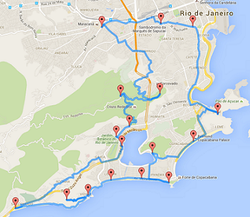

Genetic Algorithm
============

A [Genetic Algorithm](https://en.wikipedia.org/wiki/Genetic_algorithm) is a search heuristic that mimics the process of natural selection.

It's used to tackle problems that would otherwise take trillions of iterations to solve with a smart usage of random mutations and evaluation of possibilities.

Rio de Janeiro Optimal Tour
--------

The goal of this is to calculate the best route to visit a set of places without going through all the possibilities (brute-force), but rather using a Genetic Algorithm.

This implementation has been largely based on [Dr. Randal S. Olson's algorithm](http://www.randalolson.com/2015/03/08/computing-the-optimal-road-trip-across-the-u-s/). 

Several improvements and adaptations have been made, being the main ones:
- Loading of placemarks from a Google Maps MyMaps map, rather than from a string set.
- Generation of the html visualization file in runtime, based on a template.
- Clearer exibition of partial results in several steps.
- Easier way to tune and configure several aspects of the algorithm and processes.
- Checking existence of waypoints file and only making API requests when it doesnt exist.

You can check the map I've created to use in this project here: [Rio De Janeiro Places Map](https://www.google.com/maps/d/edit?mid=zeE3CQjyMLjM.kVO3Qd7EYm6Y)

Limitation:
- Since Google Maps only allows 2500 free calls/day, the maximum number of places possible with a free api-key is 71.

